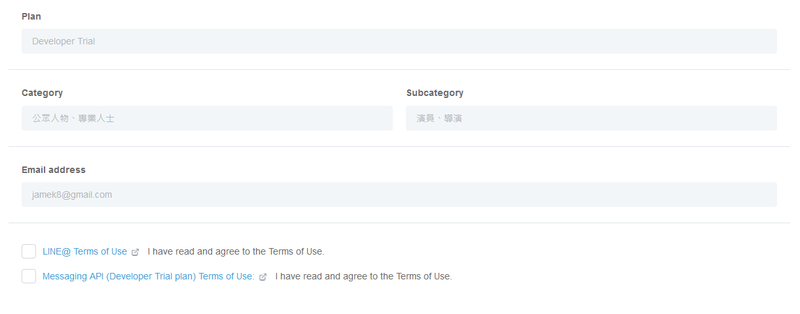
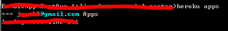

# LineBot_Basic
建立一個Line的回聲機器人

先說明會用到以下幾個部分，需要安裝的東西會在每個部分逐步解釋
1. Line
2. Heroku
3. 基本部署

## STEP1  Line
請先到 <https://developers.line.biz/en/> 註冊自己的帳號吧。
完成之後我們來到Developer的首頁(需要注意是要來到Line "Developer"，如果是Line Manager也是可以但是很多地方沒辦法設定)  
  
有一個我已經本來就創建好的Provider了，剛申請好的帳號會是空的，這裡就按下"Create New Provider"，接下來會有一連串的確認名稱，公司等等之後按下結束。
  

不過因為我已經有建立過了就不再建立了，完成之後回到上一張圖的介面我們把剛剛建立好的Provider選下去。
  
  
  
  
我們選擇中間的"Messaging API"，進去後會進入一個輸入基本資料的介面依照所需的部分選取吧。  
這邊要注意帳號的名字"七天"才能修改一次，像我設定成"測試v0.1"就只能先這樣了。  
(那隻很可愛的貓是我的家貓歡迎追蹤 <https://www.facebook.com/catEchoLin/>)  
  
  
再選擇方案的部分之後都可以再更動，所以先不需要太緊張，這邊就快速通過就好囉。  
在Confirm之前的記得把，下方的check box勾起來  
  
申請完之後我們會來到BOT的設定之中同時你自己的帳號也會加入這個機器人成為好友。  
現階段可以去[Line Manager](https://admin-official.line.me/)可以進行基本設定，不用寫程式也可以做一些文字或圖片等等的回覆，也能設定一些服務了。  
第一步份的建立就到這裡完成了。(網頁先不要關閉喔)  

## STEP2  Heroku
這邊會利用Heroku的平台來放我們的Line Bot，請先到[Heroku](https://dashboard.heroku.com/apps)進行註冊。
因為Line Bot要求是一個https的網址，透過Heroku就可以擁有https的網域了，也可以使用google等等的服務。

完成註冊後可以透過[連結](https://cli-assets.heroku.com/heroku-x64.exe)來下載Windows-64bit的安裝檔。
如果並非Windows64-64bit請點選[這裡](https://devcenter.heroku.com/articles/getting-started-with-python#set-up)

安裝過程就不贅述了，完成後按下finish。 (沒有Git的朋友可能要麻煩再去安裝Git)  
  

接下來我們開啟CMD視窗輸入
```cmd
heroku login
```
如果這部分發現沒有heroku的指令的話請去環境變數設定。
之後會導引到網頁進行登入  
  
CMD應會顯示
```
Logged in as XXXX@OOOO.YYYY
```
完成這個步驟之後我們來建立一個APP用來到時候上傳我們的Line Bot。 
來到[Heroku](https://dashboard.heroku.com/apps)我們選取New > Create new app，習慣command的話也可以用command來新增。
以我的介紹流程我覺得用網頁新增會比較流暢  
  
隨後鍵入想要的App名稱，在Heroku上名稱是無法共用的，所以很有可能遇到重複  
  
另外必須以小寫開頭，且不能用底線空白等等的符號的限制。
創建成功後我們又到了一個段落囉。

## STEP3  基本部署
接下來我們來抓取一個範例的專案吧，雖然有官方提供的code，但是我們要做Line Bot所以還是抓取這篇範例裡的code吧
```cmd
git clone https://github.com/jj2564/LineBot_with_Database
cd LineBot_with_Database
```
看到資料夾內有幾個檔案這邊說明一下
* app_run.py
* requirements.txt
* Procfile  
三個都可以透過文字編輯器開啟，先從app_run.py修改  
  
app_run.py目前的code可以做出一個回聲蟲機器人。

這時我們回到剛剛的Line Provider的頁面吧，可以透過下圖Issue的按鈕取得Channel access token把文字取代，要保留''符號喔。
Channel secret的部分也可以在這個頁面找到。
  
並且我們也將圖中的
* Use webhooks
* Allow bot to join group chats(選改)
改成Enable
* Webhook URL  

這邊我們回到[Heroku](https://dashboard.heroku.com/apps)選取上一步建立出來的APP > Settings > Domains and certificates，可以找到你的網址。
網址的規則是 
```url
https://[YOUR-APP-NAME].herokuapp.com/callback
```
按照這樣填入URL。
現在我們來把專案直接打上Heroku吧

1. 我們可以先用
   ```
   heroku apps
   ```
    來查看上面是否有創建好的APP(手抖很難看抱歉)  
  

2.   再鍵入指令
   ```
   heroku git:remote -a 你的APP的名字
   ```
3. 最後設定Git
  ```
  git add .
  git commit -m "上傳的註記"
  git push heroku master
  ```
    add的時候可能會跳出些警告，再打一次就好。 

如果順利的話我們就可以來我們的Line跟機器人對話囉。
